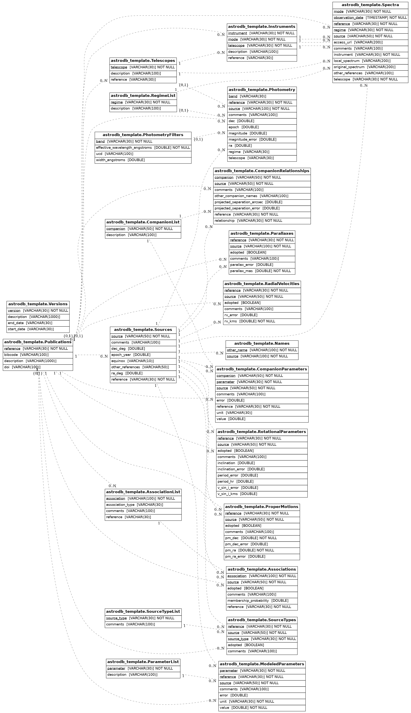

astrodb-template-db
---------------------------

  

A Database of Stellar Flares detected in the Rubin LSST -- Built using the astroDB template.

Entity relationship diagram of the template schema

